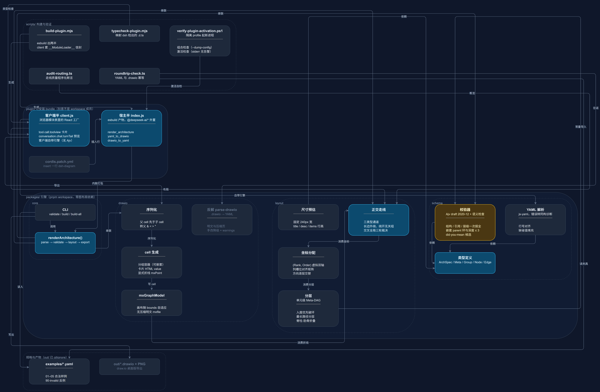

# dsh-diagram

[English](README.md) | 中文

## Summary

dsh-diagram 把一段简短的系统 YAML 描述 —— 谁包含谁、谁调用谁 —— 变成一张深色卡片式架构图。描述里**只写语义**：坐标、折行、分层、正交走线、分组包络、配色全部由引擎计算，模型和人都不需要碰几何。仓库里有两样共享同一个引擎的东西：一组负责校验、布局、导出的 TypeScript workspace 包，以及一个可安装的 [DeepSeek Harness](https://github.com/deepseek-ai/deepseek-harness)（`dsh`）插件 —— 它注册三个工具、在对话里渲染预览卡片，并导出一份可以继续在 draw.io 里精修的明文 `.drawio`。布局链路**不依赖任何图布局库**（ELK 与 dagre 都评估过后移除）；50 个节点的图在个位数毫秒内排完，走线不变量由代码断言而不是靠肉眼。

## Table of Contents

- [能力与工具](#能力与工具)
- [用法示例](#用法示例)
- [Use this repository](#use-this-repository)
- [Understand the implementation](#understand-the-implementation)
- [Further Exploration](#further-exploration)
- [Model Experience](#model-experience)
- [Known Limitations and Deferred Work](#known-limitations-and-deferred-work)
- [Dev Note](#dev-note)

## 能力与工具

输入一段 YAML 描述，出来三个工具 —— 这就是插件的全部对外能力：

| 工具 | 做什么 | 入参 | 返回 |
| :--- | :--- | :--- | :--- |
| `render_architecture` | 模型内联写 YAML，对话里直接出预览卡片 | `title`（必填）、`yaml_spec`（必填）、`save_drawio?`（默认 `false`） | `groups` / `nodes` / `edges` / `width` / `height` / `file_name`，落盘时另带 `saved_path` |
| `yaml_to_drawio` | 渲染「人手改过」的 `.yaml`，`.drawio` 写在 **YAML 同目录** | `path`（必填）、`save_drawio?`（默认 **`true`**） | 与上一条同构 |
| `drawio_to_yaml` | 回程：把在 draw.io 里手调过的 `.drawio` 反解回语义 YAML | `path`（必填） | `yaml_spec` + `warnings[]`（几何坐标、自由图形、自定义样式、`layout` 三个旋钮） |

在对话里实际得到的东西：

- **对话内的深色预览卡片** —— 可缩放、连线悬浮高亮；卡片数据走 tool-result 元数据，50 个节点的图也不多花一点模型上下文。
- **一份明文 `.drawio`** —— 未压缩 XML，除 `<diagram>` 的 id/name 外与 CLI 产物逐字节一致，可以继续在 draw.io 里精修，不存在锁定。
- **一条往返通道** —— `drawio_to_yaml` 能从手改过的文件里把标题、描述、`items`、variant 和嵌套关系捡回来，捡不回来的逐条列进 `warnings`，绝不猜。
- **一次性的结构化失败报告** —— 结构、引用、层级三类问题一次列全，每条带路径、错误码与 did-you-mean 候选（上限 12 条），模型一次重试就能改完。

## 用法示例

下面这张图没有一笔是手画的，整条链路就是产品的全部：**一句话进 → 一次工具调用 → 对话里出一张卡片**。示例对象就是这个仓库自己。

**1 · 用一句话提需求。** *「把 dsh-diagram 这个仓库的结构画成架构图。」* 不提 YAML、不提坐标、不提配色 —— 写 DSL 是模型的事，不是用户的事。

**2 · 模型写出规格。** 只写语义：谁包含谁、谁依赖谁。位置和色值一个都不写，因为两样都由引擎算。下面是它为这个仓库写出的规格：

<details>
<summary>YAML</summary>

```yaml
version: "1.0"

meta:
  title: dsh-diagram 仓库关系图
  desc: packages/ 引擎 · plugin/ 可安装 bundle · scripts/ 构建与验证
  summary: 本图由本仓库自己的引擎渲染：YAML → 校验 → 分层/坐标/走线 → .drawio
  guide: 箭头 = 依赖 / 使用方向（A → B：A 依赖、读取或写出 B）

layout:
  direction: TB

groups:
  - id: g_pkgs
    title: packages/ 引擎（pnpm workspace，零图布局依赖）
    variant: filled
  - id: g_schema
    title: schema
    parent: g_pkgs
  - id: g_layout
    title: layout
    parent: g_pkgs
  - id: g_drawio
    title: drawio
    parent: g_pkgs
  - id: g_core
    title: core
    parent: g_pkgs
  - id: g_plugin
    title: plugin/ 可安装 bundle（刻意不是 workspace 成员）
    variant: filled
  - id: g_scripts
    title: scripts/ 构建与验证
  - id: g_spec
    title: 规格与产物（out/ 已 gitignore）
    variant: dashed

nodes:
  - id: n_types
    title: 类型定义
    group: g_schema
    desc: ArchSpec / Meta / Group / Node / Edge
    variant: primary
  - id: n_validate
    title: 校验器
    group: g_schema
    desc: Ajv draft 2020-12 + 语义检查
    variant: warning
    items:
      - 结构 / 引用 / 层级一次报全
      - 嵌套 parent 环与深度 ≤ 3
      - did-you-mean 候选
  - id: n_parse
    title: YAML 解析
    group: g_schema
    desc: js-yaml，错误转同构诊断
    items:
      - 行号对齐
      - 缺省值填充

  - id: n_sizing
    title: 尺寸预估
    group: g_layout
    items:
      - 固定 240px 宽
      - title / desc / items 行高
  - id: n_layering
    title: 分层
    group: g_layout
    desc: 单元级 Meta-DAG
    items:
      - 入度优先破环
      - 最长路径分层
      - 脊柱-肋骨折叠
  - id: n_placement
    title: 坐标分配
    group: g_layout
    items:
      - (Rank, Order) 虚拟双轴
      - 列槽位对齐矩阵
      - 方向逐层交替
  - id: n_routing
    title: 正交走线
    group: g_layout
    variant: primary
    items:
      - 三类型通道
      - 长边外绕、绕开无关组
      - 交叉全局三轮裁决

  - id: n_model
    title: mxGraphModel
    group: g_drawio
    items:
      - 画布随 bounds 自适应
      - 无压缩明文 mxfile
  - id: n_cells
    title: cell 生成
    group: g_drawio
    items:
      - 分组容器（可嵌套）
      - 卡片 HTML value
      - 显式折线 mxPoint
  - id: n_serialize
    title: 序列化
    group: g_drawio
    items:
      - 父 cell 先于子 cell
      - 转义 & < > "
  - id: n_parse_drawio
    title: 反解 parse-drawio
    group: g_drawio
    desc: .drawio → YAML
    variant: muted
    items:
      - 明文与压缩页
      - 手改降级 + warnings

  - id: n_render
    title: renderArchitecture()
    group: g_core
    desc: parse → validate → layout → export
    variant: primary
  - id: n_cli
    title: CLI
    group: g_core
    desc: validate / build / build-all

  - id: n_host
    title: 宿主半 index.js
    group: g_plugin
    variant: primary
    desc: esbuild 产物，@deepseek-ai/* 外置
    items:
      - render_architecture
      - yaml_to_drawio
      - drawio_to_yaml
  - id: n_client
    title: 客户端半 client.js
    group: g_plugin
    variant: primary
    desc: 浏览器模块表里的 React 工厂
    items:
      - tool.call.toolview 卡片
      - conversation.chat.turnTail 预览
      - 客户端自带引擎（无 Ajv）
  - id: n_patch
    title: cordis.patch.yml
    group: g_plugin
    desc: insert 一行 dsh-diagram
    variant: muted

  - id: n_build_plugin
    title: build-plugin.mjs
    group: g_scripts
    items:
      - esbuild 出两半
      - client 套 __ModuleLoader__ 信封
  - id: n_typecheck
    title: typecheck-plugin.mjs
    group: g_scripts
    desc: 映射 dsh 检出的 .d.ts
  - id: n_selfcheck
    title: verify-plugin-activation.ps1
    group: g_scripts
    desc: 隔离 profile 起新进程
    items:
      - 组合检查（--dump-config）
      - 激活检查（stderr 无告警）
  - id: n_audit
    title: audit-routing.ts
    group: g_scripts
    desc: 走线质量程序化断言
  - id: n_roundtrip
    title: roundtrip-check.ts
    group: g_scripts
    desc: YAML 与 .drawio 幂等

  - id: n_examples
    title: examples/*.yaml
    group: g_spec
    items:
      - 01–05 合法样例
      - 90-invalid 反例
  - id: n_out
    title: out/*.drawio + PNG
    group: g_spec
    variant: muted
    desc: draw.io 桌面版导出

edges:
  - from: n_parse
    to: n_types
    label: 依赖
  - from: n_validate
    to: n_types
    label: 依赖
  - from: n_sizing
    to: n_types
    label: 依赖
  - from: n_layering
    to: n_validate
    label: 常量导入
  - from: n_placement
    to: n_layering
    label: 消费分层
  - from: n_routing
    to: n_placement
    label: 消费坐标
  - from: n_model
    to: n_routing
    label: 消费折线
  - from: n_cells
    to: n_model
    label: 写 cell
  - from: n_serialize
    to: n_cells
    label: 序列化

  - from: n_render
    to: n_validate
    label: 串联
  - from: n_render
    to: n_routing
    label: 串联
  - from: n_render
    to: n_serialize
    label: 串联
  - from: n_cli
    to: n_render
    label: 调用
  - from: n_cli
    to: n_examples
    label: 读入
  - from: n_cli
    to: n_out
    label: 写出

  - from: n_host
    to: n_render
    label: 内联打包
  - from: n_client
    to: n_parse
    label: 自带引擎
  - from: n_client
    to: n_routing
    label: 布局
  - from: n_client
    to: n_serialize
    label: 导出
  - from: n_patch
    to: n_host
    label: 插入行

  - from: n_build_plugin
    to: n_host
    label: 生成
  - from: n_build_plugin
    to: n_client
    label: 生成
  - from: n_typecheck
    to: n_client
    label: 类型检查
  - from: n_selfcheck
    to: n_host
    label: 激活自检
  - from: n_audit
    to: n_routing
    label: 断言
  - from: n_roundtrip
    to: n_parse_drawio
    label: 往返
  - from: n_roundtrip
    to: n_examples
    label: 读夹具
```

</details>

**3 · 调一次工具。**

```text
render_architecture(
  title     = "dsh-diagram 仓库关系图",
  yaml_spec = <上面的 YAML>
)
```

这次调用在对话里只留一行正文 —— 从不回 XML：

```text
已生成架构图：8 个分组 / 23 个节点 / 27 条连线，画布 2352×1540；预览卡片已挂在对话中，可导出 dsh-diagram 仓库关系图.drawio。
```

**4 · dsh 把卡片渲染出来。** 可缩放、连线悬浮高亮；下面的 PNG 就是同一份布局经 draw.io 导出的结果：



**5 · 顺手拿走文件，或者下次再来。** `save_drawio: true` 会把 `.drawio` 写进会话工作区，可以继续在 draw.io 里精修；`drawio_to_yaml` 把手改过的图变回 YAML，同一条闭环能再跑一遍。规格写错时也只回一份报告：每个问题都带路径与 did-you-mean 候选。

## Use this repository

### 安装插件

插件在 [`plugin/`](plugin) 里，是一个自包含 bundle（**刻意不是** workspace 成员）。装进 `dsh` profile 有两种方式 —— 从 npm，或直接从检出目录：

```
plugin_manager  install_bundle   target: C:\path\to\dsh-diagram\plugin
```

```bash
dsh plugin add @gjy_1992/dsh-diagram
```

插件的**宿主半**改动需要重启 `dsh` 才生效（Node 会按 URL 缓存模块作业）；**客户端半**刷新页面即生效。三个工具与 YAML 速查见 [`plugin/README.md`](plugin/README.md)。

### 从命令行跑引擎

```bash
pnpm install
pnpm cli validate examples/03-rpc-items.yaml      # 结构化诊断，exit 0/1
pnpm cli build examples/03-rpc-items.yaml -o out  # -> out/03-rpc-items.drawio
pnpm build:examples                               # 一次跑完全部样例
```

### 验证

这个项目每一条结论背后都有一条命令：

| 命令 | 证明什么 |
| :--- | :--- |
| `pnpm build` | 整个 workspace 在 `strict` 下类型检查通过 |
| `pnpm build:examples` | 5 份合法规格端到端出图；反例以结构化错误失败 |
| `pnpm audit:routing` | 逐个样例统计非正交段、穿节点、穿无关分组框、交叉对数（前三项必须为 0） |
| `pnpm verify` | 渲染全部样例，并用本机 draw.io 桌面版 CLI 把每份 `.drawio` 导成 PNG |
| `pnpm build:plugin` | 用 esbuild 打包插件两半（确定性：干净重建无 diff） |
| `pnpm verify:activation` | 在新进程里起一个隔离 `dsh` profile，断言插件**既组合进来又真的激活** |
| `pnpm roundtrip` | `YAML → .drawio → YAML` 保持一致且幂等 |

`pnpm typecheck:plugin` 额外需要一个已构建的 `dsh` 源码检出（见[已知限制](#known-limitations-and-deferred-work)）。

## Understand the implementation

### 两半，一个引擎

```text
schema  ──►  layout  ──►  drawio  ──►  core        （引擎，pnpm workspace）
                                        │
                    plugin/src/host.ts ─┘           （三个工具；引擎在打包时内联）
                    plugin/src/client.tsx           （预览卡片；引擎在浏览器里跑）
```

| 路径 | 职责 |
| :--- | :--- |
| [`packages/schema`](packages/schema) | TypeScript 类型、手写 JSON Schema、Ajv 校验、拓扑与层级检查、`js-yaml` 解析、带 did-you-mean 的结构化诊断 |
| [`packages/layout`](packages/layout) | 尺寸与文本度量、单元级 Meta-DAG 分层、脊柱-肋骨行内折叠、虚拟双轴 `(Rank, Order)` 上的引力排序、正交走廊走线 |
| [`packages/drawio`](packages/drawio) | `mxGraphModel` 生成、容器/卡片/连线 cell、深色样式映射、明文序列化 —— 以及反方向的 `parse-drawio` |
| [`packages/core`](packages/core) | `renderArchitecture()`（与宿主无关的编排入口：`parse → validate → layout → export`）与 CLI |
| [`plugin`](plugin) | 可安装的 `dsh` bundle：宿主半三个工具 + 客户端半预览卡片与回合末尾预览 |

### 布局为什么自己写

最初的设计用 ELK.js。两条实测死路把它否掉了：全局单次分层会把并行链推成斜线错位；而 `compound` 布局配合 `SEPARATE_CHILDREN` 会**静默丢弃每一条跨子单元边界的边**，于是任何含子分组的单元都排不出顺序。现在的引擎自建单元级 DAG、按入度优先破环、按最长路径分层、把伴生链折进同一行、按引力重心做层内排序，再让每条边走类型化走廊。50 节点全链路 1–13 ms（ELK 原型是 284 ms）。

### 验证风格

项目的规矩是「结论必须有命令背书」：走线不变量在代码里断言（`pnpm audit:routing`）；插件的激活由「新进程起一个一次性 profile」断言（`pnpm verify:activation`）；两条导出通道逐字节对比（CLI 写的 `.drawio` 与工具写的只差 `<diagram>` 的 id/name）。

## Further Exploration

- [`prd.md`](prd.md) —— 需求规格说明书，含 DSL 与布局算法的规格级定义。
- [`PLAN.md`](PLAN.md) —— 工作计划与决策记录：每一次实测、每一次被推翻的决定、每一个已知的坑（Node 模块作业缓存、`pointer capture` 吞点击、基于 peer 的模块路由、PowerShell 编码）。
- [`design.md`](design.md) —— 布局 Spec v2.0（虚拟双轴模型、折叠总闸、走廊类型）。
- [`examples/`](examples) —— 5 份合法样例（最小、分组、密集 `items`、三层嵌套、50 节点压力）与 1 份专门练诊断的反例。

## Model Experience

### 模型看到什么

三个工具、每回合一行正文摘要，以及结构化的失败：

- `render_architecture` —— 模型内联写 YAML；工具描述里带着完整的 DSL 契约（字段、三个枚举、「禁止坐标与十六进制色值」）。
- `yaml_to_drawio` / `drawio_to_yaml` —— 面向「人手改过的规格 / 手调过的 `.drawio`」的文件级通道。
- 成功只回一行统计（`N 个分组 / N 个节点 / N 条连线，画布 W×H`），从不回 XML：除非明确要文件，`.drawio` 留在宿主；卡片需要的数据走 tool-result 元数据，同样不进模型上下文。
- 失败一次把结构、引用、层级三类问题全部列出，每条带路径、错误码和 did-you-mean 候选（上限 12 条）—— 模型一次重试就能改完，而不是一轮只修一个错。

### Token 影响

模型唯一要写的就是 YAML。一张 9 节点、带分组卡片与 RPC 列表的图，YAML 只有几百 token；等价的裸 draw.io XML 要贵一个数量级，而且照样排得难看 —— 因为模型不擅长绝对坐标。

## Known Limitations and Deferred Work

- **行内 ` ```arch-yaml ` 围栏预览（PRD Phase 3）已挂起。** `dsh-client-ui-primitives` 的 markdown 渲染器只吃 props —— 没有代码围栏注册表，内部也没有槽位 —— 所以插件无法在不接管整个 assistant chat node 的前提下，把围栏原地换成预览。新查到的一条路（插件自有的 Conversation Definition + `conversation.chat.node` 视图）能在**流里**多出一行，但仍不能替换消息正文；待裁决。见 `PLAN.md` §P2.15。
- **`pnpm typecheck:plugin` 需要一个已构建的 `dsh` 源码检出。** 安装版桌面运行时没有随包发布 `@deepseek-ai/cordis` 的类型声明，只靠发行包做类型检查会得到一份缺类型的假绿。
- **卡片的像素级视觉回归尚未自动化。** 绕法已知（截图前先展开宿主折叠的 step 行），但目前仍是人工检查。
- **Windows 上的验证脚本不可移植。** `pnpm verify` 与 `pnpm verify:activation` 通过 PowerShell 驱动本机 draw.io 桌面版 CLI 与安装版 Electron 运行时。

### Dev Note

`PLAN.md` 是「为什么是这样」的权威记录。改动布局或走线行为之前，先读它的决策记录（§7 与 Phase 2）—— 那里记着若干看起来更合理、实测后被否掉的改进，包括 ELK 的两条死路与交叉的全局三轮裁决。

## License

MIT —— 见 [`LICENSE`](LICENSE)。